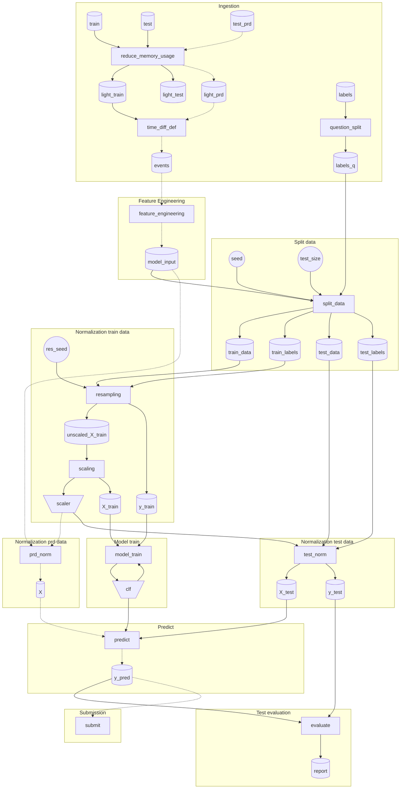

# Pipeline design

```mermaid
flowchart TB
    subgraph Ingestion
        id[(train)]-->reduce_memory_usage
        id2[(test)]-->reduce_memory_usage
        id30[(test_prd)]-.->reduce_memory_usage
        reduce_memory_usage --> id1[(light_train)]
        reduce_memory_usage --> id3[(light_test)]
        reduce_memory_usage -.->id31[(light_prd)]
        id4[(labels)]-->question_split
        id31[(light_prd)] -.-> time_diff_def
        id1[(light_train)]-->time_diff_def
        question_split-->id5[(labels_q)]
        time_diff_def-.->id6[(events)]
    end
    subgraph Feature Engineering
        id6[(events)] -.-> feature_engineering
        feature_engineering -.-> id7[(model_input)]
    end
    subgraph Split data
        id7[(model_input)] --> split_data
        id5[(labels_q)] --> split_data
        id8((seed)) --> split_data
        id9((test_size)) --> split_data
        split_data --> id10[(train_data)]
        split_data --> id11[(train_labels)]
        split_data --> id12[(test_data)]
        split_data --> id13[(test_labels)]
    end
    subgraph Normalization train data
        id10[(train_data)] --> resampling
        id11[(train_labels)] --> resampling
        id14((res_seed)) --> resampling
        resampling --> id16[(unscaled_X_train)]
        resampling --> id17[(y_train)]
        id16[(unscaled_X_train)] --> scaling
        scaling --> id15[\scaler/]
        scaling --> id18[(X_train)]
    end
    subgraph Normalization prd data
        id7[(model_input)] -.-> prd_norm
        id15[\scaler/] -.-> prd_norm
        prd_norm -.-> id32[(X)]
    end
    subgraph Model train
        id19[\clf/] --> model_train
        id18[(X_train)] --> model_train
        id17[(y_train)] --> model_train
        model_train --> id19[\clf/] 
    end
    subgraph Normalization test data
        id12[(test_data)] --> test_norm
        id13[(test_labels)] --> test_norm
        id15[\scaler/] --> test_norm
        test_norm --> id20[(X_test)]
        test_norm --> id21[(y_test)]
    end
    subgraph Predict
        id19[\clf/] --> predict
        id20[(X_test)] --> predict
        id32[(X)] -.-> predict
        predict -.-> id22[(y_pred)]
    end
    subgraph Test evaluation
        id21[(y_test)] --> evaluate
        id22[(y_pred)] --> evaluate
        evaluate --> id23[(report)]
    end
    subgraph Submission
        id22[(y_pred)] -.-> submit
    end
```
